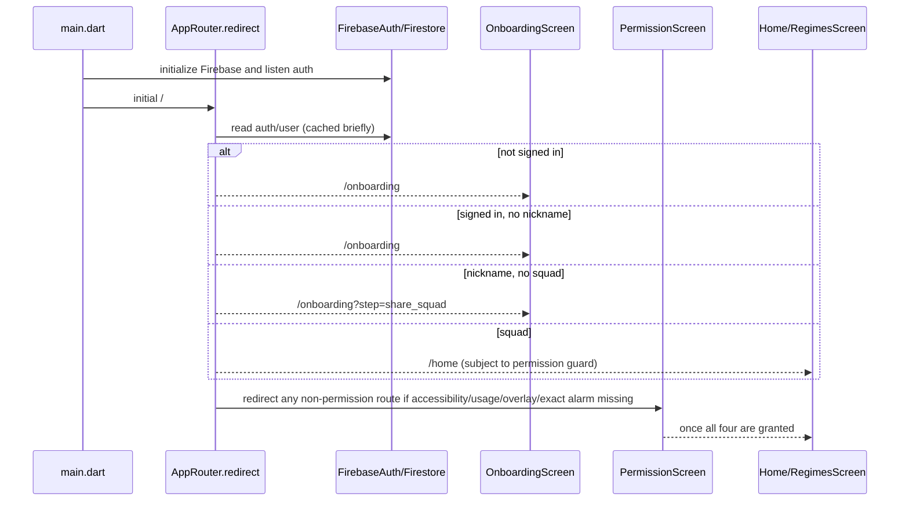

# Revoke Revival Audit

Audit date: 2026-09-04

Scope: repository-only reconstruction of the current Flutter, Android, Firebase, persistence, and test implementations. Existing `project_meta/` documents were read first but were treated as claims to verify, not as authority. No application source, dependency, Firebase rule, or build file was changed for this audit.

## 1. Executive Summary

Revoke is currently an Android-first Flutter application with a real, working enforcement core when the user has Usage Access, Accessibility, overlay, and exact-alarm permissions. Flutter owns authentication, onboarding, schedule management, squad/Tribunal UI, settings, and locally cached insights. Kotlin owns the enforcement decision, native overlay, temporary unlock storage, alarms, and service recovery. Firebase Auth, Firestore, FCM, and callable/triggered Cloud Functions provide the social and server workflow.

The core is salvageable, but the repository is not a release-ready rehabilitation product. Time-block and usage-limit hard blocking are implemented; launch-count schedules are not. Accessibility is the live foreground-event path, while `AppMonitorService` remains a UsageStats fallback/backstop. Usage accumulation and Insights still come from UsageStats even during Accessibility operation, so the system has two different notions of foreground truth. This is the most important architectural reliability issue.

The most serious product breakages are the onboarding path, which can skip steps and never stores the vow/goal, and the fact that taper plans are only available later from Home rather than being connected to onboarding. The full Flutter test suite is also not healthy: its legacy counter smoke test mounts `RevokeApp` without Firebase initialization and fails with `[core/no-app]`.

The application does not require a full rebuild. The native enforcement core, local-first schedule cache, callable Tribunal workflow, Firestore rules, and focused tests are valuable assets. A controlled revival should first establish a stable enforcement/onboarding/schedule release, then harden synchronization and recovery. Money-backed challenges, appeals, richer analytics, and community-regime concepts are present in product intent or scaffolding but are not current product capabilities.

Biggest threats to resuming development:

- permission and OEM service reliability is treated as a product dependency but is not proven by repository tests;
- Flutter onboarding and router guards can strand or skip users;
- schedule synchronization has no version/conflict protocol;
- UsageStats-derived usage is treated as the budget truth without confidence or tamper handling;
- Tribunal approval reaches native enforcement only through a live/restarted Flutter client listener;
- admin/mock tooling and legacy compatibility paths contradict current product documentation;
- the repository has only a small set of unit/rules tests and no device-level enforcement test.

## 2. Current Architecture

The current implementation is a hybrid rather than the historical “foreground service only” design.

```mermaid
flowchart TD
    Launch[main.dart\nFirebase + services] --> Router[GoRouter redirect guards]
    Router --> Auth[Firebase Auth / users/{uid}]
    Auth --> Onboarding[8-step onboarding]
    Auth --> Home[Home / schedules]
    Home --> ScheduleService[ScheduleService\nSharedPreferences first]
    ScheduleService --> RegimeService[Firestore users/{uid}/regimes]
    ScheduleService --> Bridge[NativeBridge MethodChannel]
    Bridge --> Engine[EnforcementEngine\nRevokeConfig cache]
    Accessibility[RevokeAccessibilityService\nwindow-state events] --> Engine
    Usage[AppMonitorService\nUsageStats fallback/backstop] --> Engine
    Engine --> Overlay[BlockerOverlayController]
    Overlay --> Plea[Flutter plea compose]
    Plea --> Functions[Cloud Functions callables/triggers]
    Functions --> Tribunal[pleas, votes, messages, notifications]
    Tribunal --> FlutterListener[Flutter approved-plea listener]
    FlutterListener --> Bridge
    Functions --> FCM[FCM / native amnesty fallback]
```

Startup is in `lib/main.dart`: bindings are ensured, Firebase is initialized, theme and local notifications are initialized, the global FCM topic and Auth token synchronization are started, native overlay callbacks are registered, and `ScoringService` periodic synchronization is started before `runApp(GlobalAppServices(child: AppRoot()))`.

`GlobalAppServices` observes app lifecycle, revives the native service, synchronizes schedules, hydrates settings after auth changes, registers the approved-Plea listener, and applies approved temporary unlocks to native storage. `AppRoot` creates `MaterialApp.router` with `AppRouter.router`.

The principal runtime split is:

- `RevokeAccessibilityService`: current primary foreground detector and immediate enforcement path for window-state events.
- `AppMonitorService`: foreground-service lifecycle, UsageStats fallback, polling backstop, temporary-unlock lifecycle, and service heartbeat.
- `EnforcementEngine`: persisted schedule cache, whitelist/amnesty/unlock bypasses, schedule matching, usage-limit calculation, and block/reminder presentation selection.
- `BlockerOverlayController`: native application-overlay UI; hard block, soft reminder, interstitial, plea, squad setup, and blocked-attempt broadcast.
- `AppMonitorCoordinator`, `BootReceiver`, `ServiceRestartReceiver`, `AlarmScheduler`, and WorkManager watchdog: restart and wake-up orchestration.

### Native authority table

| Concern | Current authority | Evidence and qualification |
|---|---|---|
| Foreground-app detection | `RevokeAccessibilityService` when enabled; `AppMonitorService` fallback/backstop | `RevokeAccessibilityService.onAccessibilityEvent`; `AppMonitorService.checkForegroundApp` and `maintainEnforcementWhileAccessibilityActive` |
| Usage accumulation | `UsageEventsSessionCalculator` using UsageStats events | Called by `EnforcementEngine.evaluateUsageLimitMatch`, Home status, and Insights; no Accessibility-derived accumulator |
| Restriction evaluation | `EnforcementEngine` | `findBlockMatch`, `evaluateAndApply`, `findReminderPresentation` |
| Soft reminders | `RevokeAccessibilityService` session timer and `BlockerOverlayController` | 5-second Accessibility handler, soft preference/cooldown; only usage-limit schedules produce reminder presentations |
| Mid-session reminders | `RevokeAccessibilityService` | `INTERSTITIAL_THRESHOLD_MS` default 15 minutes; same in-memory session only |
| Hard blocking | `EnforcementEngine` plus `BlockerOverlayController`; Accessibility path performs escape/home action first | `triggerEscapeAndOverlay`, `show`, `GLOBAL_ACTION_HOME`/RECENTS fallback |
| Temporary unlocks | Native `RevokeConfig` SharedPreferences after Flutter applies an approval | `MainActivity.temporaryUnlock`, `EnforcementEngine.isTemporarilyUnlocked`, `AppMonitorService` action `TEMP_UNLOCK` |
| Boot recovery | `BootReceiver` plus `AlarmScheduler` and `AppMonitorCoordinator` | Boot restores next alarm, enqueues watchdog, and checks service revival |
| Fallback tracking | `AppMonitorService` UsageStats polling | Used if Accessibility is inactive; UsageStats also remains the usage source under Accessibility |

## 3. Repository Map

| Directory/file | Responsibility |
|---|---|
| `lib/` | Flutter application, routing, models, services, feature screens, native bridge, theme, and local-first orchestration |
| `lib/core/models/` | Schedule, taper, user, squad, Plea, message, notification, rap-sheet, and UsageInsights data models |
| `lib/core/services/` | Auth, SharedPreferences persistence, schedule/regime sync, taper plans, settings/theme, squads, scoring, notifications, app discovery, and Insights bridge services |
| `lib/features/auth/` | Splash, Google sign-in, onboarding, accessibility disclosure, and permission screens |
| `lib/features/monitor/` | Installed-app selection, schedule creation, Home schedule list, usage-limit status, taper-plan CTA, and native permission warnings |
| `lib/features/insights/` and `lib/features/home/` | Usage Insights tabs/app detail and Focus Score detail |
| `lib/features/squad/` and `lib/features/plea/` | Squad roster, Tribunal UI, messages, Plea composition, voting, social interactions, and member/rule views |
| `lib/features/admin/` | Admin/God Mode dashboard, mock Tribunals, broadcasts, amnesty, user directory, ledger, score adjustment, and UI prototypes |
| `android/app/src/main/kotlin/com/crescence/revoke/` | Native permissions, AccessibilityService, foreground service, enforcement engine, overlays, UsageStats calculators, alarms, boot/restart receivers, and watchdog |
| `android/app/src/main/AndroidManifest.xml` | Usage Access, overlay, foreground-service, boot, alarms, package visibility, FCM receiver, AccessibilityService, and exported component declarations |
| `android/app/src/main/res/xml/accessibility_service_config.xml` | Accessibility configuration: window-state events and generic feedback, without window/screen content retrieval |
| `functions/index.js` | Firebase callable functions, Firestore triggers, scheduled Plea cleanup/resolution, FCM, AI fallback, rap sheet, points/social, squad, and admin operations |
| `functions/test/` | Node AI parser/sanitization tests, Firestore rules tests, and rap-sheet snapshot tests |
| `firestore.rules` | Client authorization for users, schedules, taper plans, squads, reads, and server-only Tribunal/analytics writes |
| `firestore.indexes.json` | Composite indexes, principally collection-group Plea indexes |
| `assets/` | Fonts, logos, icons, branding, and visual assets used by Flutter |
| `test/` | Two schedule/model test files plus the legacy widget counter smoke test |
| `android/`, `ios/`, `web/`, `windows/`, `macos/`, `linux/` | Flutter platform shells; Android contains the substantive product implementation |
| `build/`, `.dart_tool/`, `.idea/` | Generated Flutter/IDE/build state, not product source |
| `firebase.json`, `.firebaserc`, `google-services.json` | Firebase project selection, Firestore rules/indexes, Functions source/runtime, and Android Firebase configuration |
| `README.md`, `LLM_CONTEXT_RECONSTRUCTION.md`, `generate_context_pack.ps1` | Development/context artifacts; they are not a substitute for current code tracing |
| `project_meta/` | Product intent, historical status, prior audits, and Firebase notes; `revival_audit.md` is this source-verified audit |

The repository also contains a tracked empty Kotlin compiler-session sentinel under `android/.kotlin/sessions/`; it is generated state rather than application architecture.

Build configuration currently uses Dart SDK `^3.10.8`, Flutter packages including Firebase, `go_router`, `shared_preferences`, and local notifications; Android uses AGP 8.11.1, Kotlin 2.2.20, Gradle 8.14.0, Firebase BOM 34.9.0, WorkManager 2.10.0, Java/Kotlin target 1.8, and Functions Node 22.

## 4. Feature Reality Matrix

Statuses use only the requested categories. “Confirmed implemented” means a callable path exists and can execute in the current architecture; a screen/model alone is not treated as implementation.

### Core enforcement

| Feature | Status | Evidence |
|---|---|---|
| App discovery | CONFIRMED IMPLEMENTED | `lib/core/services/app_discovery_service.dart`: `AppDiscoveryService.getInstalledApps`; `MainActivity.getInstalledApps/getAppDetails`; Android `QUERY_ALL_PACKAGES` |
| Whitelist | CONFIRMED IMPLEMENTED | `WhitelistAppsScreen`; `PersistenceService`; `SettingsSyncService`; `NativeBridge.syncWhitelistApps`; `EnforcementEngine.isWhitelistedPackage` bypasses enforcement and UsageStats calculators |
| Time-block schedules | CONFIRMED IMPLEMENTED | `ScheduleModel`, `CreateScheduleScreen`, `RegimeService`, `ScheduleService`; `EnforcementEngine.evaluateTimeBlockMatch` |
| Usage-limit schedules | CONFIRMED IMPLEMENTED | `CreateScheduleScreen`; `EnforcementEngine.evaluateUsageLimitMatch`; `UsageEventsSessionCalculator`; Home remaining-time status |
| Launch-count schedules | DEAD/ABANDONED | `ScheduleType.launchCount` exists, but no count field/UI/evaluation; `EnforcementEngine` and `RegimeWakeupCalculator` return no launch-count enforcement |
| Accessibility enforcement | CONFIRMED IMPLEMENTED | Manifest service plus `RevokeAccessibilityService.onAccessibilityEvent`; blocks through `EnforcementEngine` and overlay |
| UsageStats fallback | CONFIRMED IMPLEMENTED | `AppMonitorService.checkForegroundApp`, `resolveForegroundPackage`, and `UsageEventsSessionCalculator`; no confidence label |
| Soft reminders | PARTIAL | `RevokeAccessibilityService` and `BlockerOverlayController.showSoftReminder`; only usage-limit budget presentations qualify, time-block launches hard-block immediately; reminder session state is in memory |
| Mid-session reminders | PARTIAL | `INTERSTITIAL_THRESHOLD_MS` and `showInterstitialReminder` exist for usage-limit sessions; no persisted session state and no time-block equivalent |
| Hard blocking | CONFIRMED IMPLEMENTED | `EnforcementEngine.evaluateAndApply`; `BlockerOverlayController.show`; Accessibility escape/home action and overlay |
| Temporary unlocks | CONFIRMED IMPLEMENTED | Flutter approved-Plea listener → `NativeBridge.temporaryUnlock` → `RevokeConfig.temp_unlocks`; expiry pruning in Engine/service/package receiver |
| Boot persistence | PARTIAL | `BootReceiver` restores alarms and attempts service revival; schedules/unlocks persist in `RevokeConfig`, but Accessibility session/reminder state does not |
| Watchdog/recovery | PARTIAL | `AppMonitorWatchdogWorker`, WorkManager unique 15-minute work, heartbeat and `AppMonitorCoordinator`; OEM/background restrictions and Accessibility death remain external failure modes |

### Behaviour and rehabilitation

| Feature | Status | Evidence |
|---|---|---|
| Onboarding | BROKEN | `OnboardingScreen` has 8 steps, but router/permission callbacks can jump directly to Recruitment and restart routing resumes by nickname; see Section 11 |
| Goal/vow storage | BROKEN | `OnboardingScreen` `_goalHours` slider has no write; button comment says “Save goal logic here if needed”; `ScoringService` defaults to 1 hour when `vowHours/goalHours` are absent |
| Historical usage baseline | PARTIAL | `MainActivity.getRealityCheck` and `getHourlyUsagePattern` query UsageStats; no durable baseline entity and no onboarding persistence |
| Taper-plan generation | CONFIRMED IMPLEMENTED | Home `_showTaperSetupSheet` derives a seven-day signal and calls `TaperPlanService.buildLinearPlan` |
| Taper-plan activation | PARTIAL | `TaperPlanService.savePlanLocalFirst` materializes an active usage-limit schedule and syncs native/cloud asynchronously; no onboarding activation and no remote hydration/conflict resolver |
| Taper progress | PARTIAL | `TaperPlanModel.limitFor`, Home active-plan display, Insights daily-goal comparison; no durable daily progress series or server progress writer |
| Focus Score | PARTIAL | `ScoringService.syncFocusScore`, blocked-attempt callable, Focus Score screens; client transaction changes score, goal is usually default because onboarding does not save it |
| Streaks | UNKNOWN | No complete streak entity or authoritative streak calculation was found in current service/backend paths |
| Analytics | PARTIAL | Native UsageInsights day/week/trend calculator and Flutter Insights views exist; no remote analytics summaries or enforcement/session event series |
| Category analytics | DEAD/ABANDONED | `AppCategorizer` categorizes app discovery UI only; `UsageInsightsCalculator` returns package totals/top apps, not category groups |
| Remaining-time calculations | CONFIRMED IMPLEMENTED | `EnforcementEngine` UsageStats session calculation and Home `_refreshUsageLimitStatuses`; accuracy depends on UsageStats and activation/day semantics |
| Offline analytics | PARTIAL | `UsageInsightsService` caches snapshots in SharedPreferences and serves cache first; Home/reality/taper baseline uses direct native calls and can fail without permission/data |

### Social

| Feature | Status | Evidence |
|---|---|---|
| Squad creation | CONFIRMED IMPLEMENTED | `SquadService.createSquad` client transaction creates `squads/{id}` and updates `users/{uid}` |
| Squad joining | CONFIRMED IMPLEMENTED | `SquadService.joinSquad` → `joinSquadByCode` callable; server transaction handles membership |
| Member management | PARTIAL | Streams and leave transaction exist; no complete server-authoritative role/member-management model beyond current squad rules |
| Plea creation | CONFIRMED IMPLEMENTED | `PleaComposeScreen` → `SquadService.createPlea` → `functions.createPlea`; solo Warden path resolves immediately |
| Tribunal attendance | CONFIRMED IMPLEMENTED | `joinPleaSession` and `participants` array; messaging also adds participants |
| Tribunal chat | CONFIRMED IMPLEMENTED | `sendPleaMessage`; `/pleas/{pleaId}/messages` stream/read path; server validation/rate limiting |
| Tribunal voting | CONFIRMED IMPLEMENTED | `castVote` writes canonical vote subdocument and legacy map; trigger resolves |
| Quorum logic | PARTIAL | `resolvePleaVerdict` waits for all eligible `participants` voters, not all squad members; attendance/participant semantics can change while active |
| Server-authoritative resolution | CONFIRMED IMPLEMENTED | Firestore writes are denied to clients for Pleas/messages/votes; callable/trigger transactions own status transitions |
| FCM Tribunal notifications | PARTIAL | `broadcastPleaCreated`, side-effect notifications, and data messages exist; FCM delivery is best effort and generic background handling is limited |
| Temporary unlock after successful Plea | CONFIRMED IMPLEMENTED | Approved Plea stream in `main.dart` applies package unlock; delivery depends on Flutter listener/engine availability |
| Rap sheet | CONFIRMED IMPLEMENTED | Functions triggers write `users/{uid}/rapSheet/latest`; `SquadService` reads it or calls `getMemberRapSheetSnapshot` |
| Social regimes/community regimes | PLANNED ONLY | Product documents discuss community/social regimes; no complete current model, write path, native synchronization, or integrated route was found |
| Community interaction | CONFIRMED IMPLEMENTED | `saluteSquadLog`, `castStone`, `prayFor`, `postBail`, squad logs, points UI; scope is squad social interaction, not community regimes |

### AI

| Feature | Status | Evidence |
|---|---|---|
| OpenRouter integration | CONFIRMED IMPLEMENTED | `functions/index.js` OpenRouter fetch, `OPENROUTER_API_KEY`, model `meta-llama/llama-3-8b-instruct:free` |
| AI Architect fallback | CONFIRMED IMPLEMENTED | `evaluatePleaFallback` Cloud Task, `_buildAiContext`, `_parseAiDecision`, `_finalizePleaWithAiDecision` |
| Tribunal timeout | CONFIRMED IMPLEMENTED | `autoFinalizeStalePleas` every minute; `forceKillStaleTribunal` deadman after five minutes |
| PII scrubbing/redaction | CONFIRMED IMPLEMENTED | `_sanitizeReasonText` strips email, URL, phone, handles, and long tokens; AI context uses category/reason/goal/status rather than identity |
| Failure behaviour | CONFIRMED IMPLEMENTED | Fetch timeout/parse/failure produces safe reject; pending deadman also rejects |
| Model configuration | CONFIRMED IMPLEMENTED | Hard-coded model and timeout constants in `functions/index.js`; API key is secret-configured |
| AI decision audit trail | PARTIAL | Plea stores AI source/model/rationale/timestamps and an AI message; no `aiEvaluations` collection or persisted full sanitized context |

### Financial

| Feature | Status | Evidence |
|---|---|---|
| Challenge model | PLANNED ONLY | PRD schema only; no current Flutter/backend challenge model or callable path |
| Pledge UI | PLANNED ONLY | PRD intent; no current challenge/pledge payment flow; Plea “beg for time” is not a financial pledge |
| Payment provider | PLANNED ONLY | No provider integration in `lib`, `functions`, Android, or configuration |
| Stripe | PLANNED ONLY | No Stripe package, secret, webhook, callable, or collection |
| Capture | PLANNED ONLY | No capture implementation |
| Refunds | PLANNED ONLY | No refund implementation |
| Appeal system | PLANNED ONLY | PRD describes `challengeAppeals`; no current model, screen, function, or rules |

## 5. Native Enforcement Architecture

### Components and call paths

`MainActivity.kt` owns the `com.revoke.app/overlay` MethodChannel. It registers pending native broadcasts for `REQUEST_PLEA` and `BLOCKED_ATTEMPT`, exposes permission/settings methods, app discovery, schedule/reminder/whitelist synchronization, usage queries, temporary unlock, and service-revive methods. If Flutter is not ready, plea/setup payloads are held in `MainActivity` until the channel is configured.

`RevokeAccessibilityService.kt` receives only `TYPE_WINDOW_STATE_CHANGED` events from the manifest configuration. It filters System UI, keyboards, launchers, and Revoke; checks whitelist/ignore logic; records the package in `EnforcementEngine`; obtains either a block or reminder presentation; and shows/hides overlays. It tracks restricted sessions in memory, uses a four-second package-leave grace period, and schedules the 15-minute interstitial threshold. It performs `GLOBAL_ACTION_HOME` with RECENTS fallback before displaying a hard-block overlay.

`AppMonitorService.kt` is a `dataSync` foreground service with `START_STICKY`. Its five-second loop writes `monitor_last_tick_ms`, stops itself when no active schedule/unlock requires monitoring, polls UsageStats roughly every 12 seconds when Accessibility is not active, and re-evaluates the last Accessibility-observed package as a backstop for active usage-limit regimes. It receives `SYNC_SCHEDULES`, `TEMP_UNLOCK`, and package-removal actions. Its older `activeSchedules`, `blockedAppsIndex`, and `updateSchedules` path remains in the file but is not the path used by current schedule synchronization.

`EnforcementEngine.kt` is the restriction authority. `syncSchedules` stores raw JSON in `RevokeConfig.schedules` and rebuilds the schedule/blocked-app cache. `findBlockMatch` handles current-day active schedules, whitelist, amnesty, temporary unlocks, type 0 time blocks, and type 1 usage limits. Type 2 launch count falls through to no match. Usage limits use `UsageEventsSessionCalculator` over target packages, beginning at the effective daily start/activation boundary. `findReminderPresentation` exposes a budget only for usage-limit schedules and only inside an open window.

`UsageEventsSessionCalculator.kt` queries Android UsageStats events, reconstructs foreground intervals, clips them to the current day and activation timestamp, excludes whitelisted/System UI/Revoke packages, and sums target packages. It returns zero without Usage Access. It is therefore both a budget source and a fallback-derived measurement; there is no source-confidence field.

`UsageInsightsCalculator.kt` separately reconstructs UsageStats sessions for day/week/trend/app detail, returning buckets, top packages, total/average usage, trend, peak, longest focus, and continuous-use values. It does not produce category aggregates or Firestore analytics records.

`BlockerOverlayController.kt` uses `TYPE_APPLICATION_OVERLAY`. Hard-block overlays emit the deduplicated `com.revoke.app.BLOCKED_ATTEMPT` broadcast, offer `ACCEPT FATE`, and if a squad exists offer `BEG FOR TIME`, which opens `MainActivity` with `REQUEST_PLEA`. Without a squad it offers `OPEN SQUAD SETUP`. Reminder overlays can be dismissed/acknowledged. Overlay rendering failures are logged to Crashlytics/non-fatal reporting.

`AppMonitorCoordinator.kt` owns the service-restart decision. It persists a unique 15-minute WorkManager watchdog and considers the service needed when persisted active type 0/1 schedules or active native unlock/amnesty state exists. It ignores launch-count schedules. `AlarmScheduler` stores one next regime wake-up in `RevokeConfig` and sends `WAKE_FOR_REGIME` to `ServiceRestartReceiver`. `BootReceiver` restores that alarm, enqueues watchdog work, and invokes revival. `PackageRemovedReceiver` removes unlock entries for deleted packages. `AmnestyReceiver` and `AmnestyPushReceiver` are a separate native bypass path for FCM `AMNESTY`, capped at 24 hours.

### Enforcement semantics that matter

- Accessibility is the immediate foreground detector when enabled, but usage totals are still UsageStats-based.
- Time blocks hard-block inside their windows; they do not receive a soft reminder presentation from `EnforcementEngine`.
- Usage-limit schedules can hard-block at the limit or outside configured windows and can show soft/interstitial reminders while under budget.
- Whitelist bypass is applied by the engine and usage calculators, so a whitelisted target package is not counted or blocked.
- Temporary unlocks and amnesty are persisted in native preferences and survive native process restart; Accessibility session/reminder timers are not persisted.
- Native schedule synchronization is a raw JSON replacement with no revision, merge, or conflict check.

## 6. Flutter Architecture

Flutter uses GoRouter, ordinary Stateful/Stateless widgets, static service classes, and `SharedPreferences`. There is no Riverpod, Bloc, Provider, or repository abstraction layer governing the app. Services directly access Firebase and SharedPreferences.

### Routing and actual launch path



`AppRouter.redirect` first applies an eight-second cached redirect decision. Unauthenticated users are sent to `/onboarding`. Admin routes `/god-mode` and `/admin/*` require the Firebase custom claim `admin`. User data is read for `squadId` and `nickname`; a squad sends splash/onboarding to Home, a nickname without a squad sends the user to the share-squad onboarding step, and a user without a nickname remains in onboarding. Independently, every non-permission route is redirected to `/permissions` unless Accessibility, Usage Access, overlay, and exact alarms are all granted. Battery-optimization exemption is requested/diagnosed but is not part of the router’s all-permissions condition.

The shell contains `/home`, `/squad`, and `/insights`; `/home` builds `RegimesScreen`, which composes/delegates to `HomeScreen`. Legacy `/marketplace` redirects to `/home`. There are separate routes for app insights, notifications, controls, settings, Plea composition, profile, Focus Score, schedule new/edit, admin/God Mode, and Tribunal detail.

The onboarding screen has Auth, Alias, Permissions, Accessibility, Delusion, Reality, Vow, and Recruitment pages. `didChangeDependencies` only interprets `step=share_squad`. Permission completion can animate straight from the permission page to the Reality page; the router can instead force `/permissions` and then `/onboarding?step=share_squad`, which can skip Delusion/Reality/Vow. The Vow slider changes `_goalHours` in memory only. Recruitment auto-creates a squad if needed. No onboarding page index, vow, goal, or exact-resume state is persisted.

### Services and feature ownership

- `AuthService`: Firebase Auth/Google Sign-In, user document bootstrap, FCM token, nickname/preferences, session validation, and account deletion.
- `PersistenceService`: legacy/local restricted-app map, whitelist list, soft-reminder enabled/frequency.
- `ScheduleService` plus `RegimeService`: local schedule cache, pending upsert/delete queues, Firestore regime encoding, native synchronization, and best-effort migration.
- `TaperPlanService`: linear plan construction, local plan cache/pending upsert, materialization into a usage-limit schedule, reminder configuration, and best-effort Firestore write.
- `SettingsSyncService` plus `ThemeService`: settings hydration/write for `appPreferences`, whitelist, reminder controls, theme mode, and accent.
- `SquadService`: squads, Pleas, Tribunal callables, messages/logs, rap-sheet reads, and social point actions.
- `NotificationService` and `InAppNotificationService`: FCM token/listeners, local notification channel, notification tap routing, amnesty broadcast, and Firestore in-app notifications.
- `ScoringService`: client Focus Score calculation/cache, blocked-attempt callable, plea beggar’s-tax deduction, and rejected-Plea penalty helper.
- `UsageInsightsService`: MethodChannel Insights call plus SharedPreferences cache.
- `NativeBridge`: all Flutter/native contracts; no typed versioning or contract schema beyond MethodChannel method names/maps.

## 7. Firebase / Backend Architecture

### Current Firestore schema from code

| Collection/path | Current writers | Current readers | Server reactions/authority |
|---|---|---|---|
| `users/{uid}` | Auth bootstrap, nickname/settings, scoring transaction, squad join/create/leave, Functions | Auth/router, squad roster, Focus Score, settings, admin | User profile, FCM token, score, squad metadata; some fields are client-writable |
| `users/{uid}/regimes/{scheduleId}` | `RegimeService` client | `RegimeService`, same-squad roster/rap-sheet paths | No trigger; client can write own regimes, same squad can read |
| `users/{uid}/taperPlans/{planId}` | `TaperPlanService` client | Rules tests/backend, no full remote hydration in service | No trigger; self read/write |
| `users/{uid}/rapSheet/latest` | Functions plea/blocked-attempt triggers | SquadService/member views | Server-only write; denormalized snapshot |
| `users/{uid}/scoreEvents/{eventId}` | `recordBlockedAttempt` Function | Focus Score detail | Server-only write; event source/type fields server-set |
| `users/{uid}/focusStats/{day}` | `recordBlockedAttempt` Function | Focus Score detail | Server-only write; blocked-attempt aggregate |
| `users/{uid}/notifications/{notificationId}` | Functions notification helpers | Notification screen/service | Server creates/deletes; user only marks `isRead` |
| `squads/{squadId}` | `SquadService.createSquad/leaveSquad` client transaction, join callable | Squad screen/service, Functions | Membership constrained by rules/callable; logs are server-only |
| `squads/{squadId}/logs/{logId}` | Functions social/Tribunal helpers | Squad log UI | Server-only write |
| `pleas/{pleaId}` | `createPlea` Function, resolution triggers/Functions, deletion marker | Squad/Tribunal/Home/admin | Client create/update/delete denied; server status/outcome authority |
| `pleas/{pleaId}/votes/{uid}` | `castVote` Function | Tribunal vote/read UI | Client vote write denied; trigger resolves |
| `pleas/{pleaId}/messages/{messageId}` | `sendPleaMessage` Function | Tribunal chat | Client message write denied; server validation/rate limits |
| `limits/{uid}` | Functions rate-limit/event bookkeeping | No client reader | Admin SDK/server-only by default rules |
| `system/stats`, `system/stats/shameLedger` | Functions/admin | Admin/operations | Server/admin operational state |

There are no current code paths for PRD collections `challenges`, `financialCommitments`, or `challengeAppeals`, nor an `aiEvaluations` collection. There is no server usage-session or daily analytics summary collection; native Insights remain local.

### Functions and resolution

`functions/index.js` exports callable functions for Pleas, voting, messages, squads, social points, admin amnesty/broadcast/mock Tribunals, score event ingestion, and rap-sheet snapshots. Firestore triggers broadcast Plea creation, resolve vote writes, and update rap sheets. Scheduled functions finalize stale Tribunals and clean old data.

`createPlea` validates user/squad/rate limits. A solo squad gets an immediate random `SYSTEM_WARDEN` decision; a non-solo Plea is active/pending, records `aiFallbackStatus: queued`, and enqueues `evaluatePleaFallback` after approximately 30 seconds plus a five-minute deadman task. `castVote` writes both canonical vote subdocuments and a legacy vote map. `resolvePleaVerdict` derives eligible voters from `participants`, waits for each expected participant, and writes the final status transactionally. `autoFinalizeStalePleas` can also resolve old active Pleas by attendance/vote timeout. The status transaction guards duplicate finalization, but notification/log side effects are not globally idempotency-keyed.

The AI fallback builds a small sanitized context: app category, requested minutes, active taper target, defector status, and sanitized reason. It does not send user email/name, raw package, or raw usage history to OpenRouter. It parses a constrained JSON decision, caps approval minutes at 15, rejects malformed/error responses, writes AI metadata and a message, and applies the same resolution side effects. It does not persist a separate AI evaluation document or full redacted context.

### Authorization findings

Firestore rules correctly deny client writes to Pleas, Plea messages, votes, rap sheets, score events, focus stats, and squad logs. Rules tests pass for these protected paths. Users can read their own profile and same-squad user documents; this means same-squad readers can also read fields stored on the user document such as `email`, `fullName`, `photoUrl`, and `fcmToken` unless application use narrows the data.

Client-authoritative or client-influenced fields remain:

- `ScoringService` directly computes and transactionally writes `users/{uid}.focusScore`, `scoringMeta`, and `scoreHistory`.
- `SquadService.createSquad` and `leaveSquad` directly mutate squad membership in client transactions, constrained by rules but not centralized in the membership callable.
- `SettingsSyncService` directly writes `appPreferences` with no server version/conflict field.
- User profile fields are broadly self-writable through Auth/settings flows.

The `admin` custom claim gates admin routes/functions, but admin UI and functions still include score adjustment, `grantAmnesty`, mock Tribunal creation/destruction, system broadcast, and operational ledger actions. This is not the unlimited Tribunal verdict override described in older claims, but it is not accurate to say all God Mode/admin override tooling has been removed.

FCM uses a `global_citizens` topic and per-user tokens. Plea creation and resolution fan-out create in-app notifications and attempt FCM delivery. Delivery failure is logged/best effort; there is no durable FCM retry/outbox.

## 8. Persistence and Synchronization

No SQLite/Hive/DataStore repository was found in the current product path. `sqflite_android` appears as a transitive/build plugin dependency, not as a product persistence layer. Important state is split between Flutter SharedPreferences, native Android SharedPreferences, memory, and Firestore.

| Entity/state | Local writer/reader | Native access | Flutter access | Restart behavior | Remote sync |
|---|---|---|---|---|---|
| Schedules | `ScheduleService` writes per-user `regime_schedules_{uid}` and pending upsert/delete sets; reads local first | Native receives active schedule JSON in `RevokeConfig.schedules` | Full read/write | Survives Flutter/native restart | Best-effort Firestore via `RegimeService`; cloud can overwrite local |
| Legacy schedules | `ScheduleService`/`RegimeService` migrate global `regime_schedules` | Via later native sync | Via migration | One-time migration/removal | Migrated to current cloud path if cloud empty |
| Native schedules | `MainActivity.syncSchedules`/`EnforcementEngine` writes `RevokeConfig` | All native enforcement reads | Only through MethodChannel | Survives native restart/reboot | Replaced by each Flutter sync; no revision |
| Whitelist | `PersistenceService`, `SettingsSyncService` | `RevokeConfig.whitelist_packages` | Settings/whitelist screens | Survives | User `appPreferences.whitelistApps`; no conflict protocol |
| Reminder settings | `PersistenceService`, `SettingsSyncService` | `RevokeConfig` soft/interstitial/cooldown keys | Settings screens | Survives | `appPreferences`; no conflict protocol |
| Temporary unlocks | Native Engine/service JSON `temp_unlocks`; Flutter only requests writes | Direct native enforcement | Reads active package list | Survives, expired entries pruned | Approval originates from Firestore but no direct native server channel |
| Amnesty | Native `amnesty_expiry`; FCM native receiver or Flutter broadcast | Direct engine bypass | Can broadcast native amnesty | Survives | Admin Function → FCM; no Firestore state read by native |
| Accessibility session/reminder state | In-memory Accessibility service | Native only | Not exposed | Lost on service/process restart | None |
| Service heartbeat | Native `monitor_last_tick_ms` | Coordinator/worker | Not directly displayed | Survives as stale value; age is checked | None |
| Taper plans | `TaperPlanService` SharedPreferences and pending upserts | Only resulting schedule/reminder config | Home/Insights | Survives Flutter restart | One-way best-effort write to `users/{uid}/taperPlans`; no remote pull/merge |
| Focus Score cache | `ScoringService` SharedPreferences `focus_score` | No | Focus Score UI | Survives | Firestore user score/history; client computes score |
| Insights cache | `UsageInsightsService` key `usage_insights_v1:<uid>:...` | Source is native | Insights reads cache then refreshes | Survives | None |
| FCM token | Firebase Messaging/Auth writes user doc | Native may receive FCM | Auth/NotificationService | Firebase-managed plus user doc | Firestore profile |

Schedule writes are explicitly local-first: local is written, a pending queue is marked, native synchronization and Firestore push are launched, and pending entries are flushed. Refresh reads local immediately and then can replace it with remote data. There is no schedule version, mutation timestamp comparison, device identity, conflict policy, or durable background retry worker. The pending queues are retried by service calls/read flows rather than an independent guaranteed worker. Taper plans have pending upserts but no pending-delete queue and no remote hydration.

The result is a useful offline-first UX for a single device, but not a conflict-safe synchronization design. A delayed cloud write or stale stream can overwrite a newer local schedule; simultaneous unawaited native/cloud writes can race; and native may continue enforcing a previous raw JSON snapshot until the next successful bridge sync.

## 9. Core Flow Traces

### Flow A — Create restriction

Actual path:

1. User opens `/regime/new`; `CreateScheduleScreen` discovers apps through `AppDiscoveryService`, selects target packages/days/windows, and supports only Time Block and Usage Limit cards. The enum has Launch Count, but the create UI does not expose it.
2. Validation uses `ScheduleBlockValidator` and local Dart rules. A `ScheduleModel` is constructed active and passed to `ScheduleService.saveSchedule`.
3. `ScheduleService.saveSchedule` normalizes usage-limit activation, writes the per-user SharedPreferences JSON, adds a pending upsert, calls `syncWithNative` and `RegimeService.saveRegime`, then flushes best effort.
4. `RegimeService.saveRegime` writes `/users/{uid}/regimes/{id}` with canonical plus legacy fields and server timestamps. The client is allowed to write its own regime.
5. `NativeBridge.syncSchedules` sends active schedules as JSON. `MainActivity` writes `RevokeConfig.schedules`, reloads `EnforcementEngine`, schedules/cancels the next alarm, attempts in-process service sync, and invokes the coordinator.
6. `EnforcementEngine` indexes target packages and evaluates on Accessibility events or UsageStats fallback.

Failure points:

- no Firebase/auth or Firestore availability prevents remote persistence, although local/native may still work;
- a later cloud refresh can overwrite a newer local cache;
- no version prevents two devices or delayed writes from replacing each other;
- Launch Count can be created only by manually shaped data and is then ignored;
- exact-alarm permission affects wake-up scheduling;
- native receives only the current active set and does not retain a conflict/version source;
- inactive schedules are not synchronized for enforcement until activated.

### Flow B — Restricted app launch

Actual path with Accessibility:

1. Android delivers `TYPE_WINDOW_STATE_CHANGED` to `RevokeAccessibilityService`.
2. The service filters system/launcher/Revoke/whitelist packages, records the package in `EnforcementEngine`, and asks `findBlockPresentation`/`findReminderPresentation`.
3. `EnforcementEngine` checks amnesty and native temporary unlocks, current day/windows/targets, and for usage limits computes UsageStats session usage.
4. A block causes escape/home action followed by `BlockerOverlayController.show`. A usage-limit package under budget may receive soft reminder/interstitial treatment. A time-block match has no reminder presentation and proceeds to hard block.
5. Hard overlay emits a deduplicated `BLOCKED_ATTEMPT` broadcast. `MainActivity` forwards it to Flutter if alive; `GlobalAppServices` invokes `ScoringService.recordBlockedAttempt`, which calls the server `recordBlockedAttempt` callable.
6. The callable writes `users/{uid}/scoreEvents/{event}`, increments `focusStats/{day}`, updates rate-limit bookkeeping, and Functions rap-sheet logic reacts.

Fallback path: if Accessibility is inactive, `AppMonitorService` polls UsageStats, calls the same Engine evaluation, and shows the overlay. While Accessibility is active it mainly backstops the last observed package for usage-limit regimes.

Failure points:

- Accessibility service can be disabled/killed or OEM-throttled;
- overlay permission failure prevents UI intervention even if a match is found;
- UsageStats can be absent/stale and returns zero for limits/analytics;
- usage accumulation is not Accessibility truth and has no confidence indicator;
- session/reminder state resets on service restart;
- Flutter absence loses the bridge-side scoring event until another native broadcast/attempt path occurs;
- repeated attempts are only four-second/package deduped;
- time-block restrictions do not use the soft-reminder path;
- if the native process has an old schedule cache, enforcement uses that snapshot until sync/recovery.

### Flow C — Temporary unlock / Tribunal

Actual path:

1. Native blocked overlay’s `BEG FOR TIME` launches `MainActivity` with `REQUEST_PLEA`, or Home schedule actions open an in-app regime Plea composer.
2. `MainActivity`/`NativeBridge` delivers app/package context; router opens `/plea-compose`.
3. `PleaComposeScreen` calls `SquadService.createPlea`, which invokes `createPlea` and applies the client beggar’s-tax score deduction after success.
4. `createPlea` creates the server-owned `/pleas/{id}`, fans out notifications, and either uses the solo `SYSTEM_WARDEN` path or queues human/AI handling.
5. Squad members join via `joinPleaSession`, chat via `sendPleaMessage`, and vote via `castVote`. Votes are written by the server callable to `/pleas/{id}/votes/{uid}` and legacy `plea.votes`.
6. `resolvePleaVerdict` or timeout/AI/deadman transaction sets status/outcome/duration and triggers notifications, logs, rap-sheet changes, and side effects.
7. Flutter listens to approved Pleas for the current user. `main.dart` deduplicates processed IDs in `processed_approved_pleas_{uid}`, then calls `NativeBridge.temporaryUnlock(package, duration)`; a `regime:` synthetic package applies pause/delete actions instead.
8. Native Engine persists expiry in `RevokeConfig.temp_unlocks`; the schedule is bypassed until expiry and expired entries are pruned.

Failure points:

- a blocked overlay cannot open Flutter if Activity/engine launch is prevented;
- if Flutter is killed or never authenticates, an approved Firestore Plea has no direct native unlock path;
- a processed-ID local set can prevent reapplication after a native write was interrupted;
- FCM notification failure does not itself resolve/apply an unlock;
- participant-based quorum is not a fixed squad quorum;
- timeout, AI, and trigger paths are transaction-guarded for status but side effects may repeat on retries;
- native unlock duration depends on client application of the approved document;
- native amnesty is a separate FCM path and is not equivalent to a package-specific Plea unlock.

### Flow D — AI fallback

Actual path:

1. A non-solo `createPlea` stores a pending/active Plea with AI fallback metadata and schedules `evaluatePleaFallback` for roughly 30 seconds plus `forceKillStaleTribunal`.
2. The task claims the Plea transactionally, loads the requester and the first active taper plan, and builds a restricted context.
3. `_sanitizeReasonText` redacts obvious PII. The context contains category, requested minutes, taper target, defector status, and sanitized reason; it does not contain raw user identity or raw package/usage history.
4. OpenRouter is called with the configured model and approximately 25-second abort timeout.
5. JSON parsing validates approve/reject, rationale, and caps approval to 15 minutes. Any failure becomes a safe rejection.
6. A transaction finalizes only a pending decision, writes AI source/model/rationale/timestamps, and adds a Tribunal message. Resolution side effects then notify and, eventually, Flutter applies an unlock for approvals.
7. The five-minute deadman rejects an unresolved pending decision. Separately, `autoFinalizeStalePleas` can timeout older active Tribunals by majority/attendance rather than invoking AI.

Failure points:

- Cloud Tasks deployment/configuration or task delivery is not proven by repository tests;
- OpenRouter/network/secret/model failure rejects rather than retries a user-friendly decision;
- no persisted AI evaluation/context document makes post-hoc audit limited;
- active timeout and queued AI task can race, with status guards determining the winner;
- the taper plan loader expects `todayLimitMinutes`, while current `TaperPlanService` writes the linear plan fields without that field, so AI context may omit today’s limit;
- approval still requires Flutter’s Firestore listener to reach native.

### Flow E — Taper plan

Actual path:

1. On Home, `_showTaperSetupSheet` takes currently active schedule target packages, calls native `getRealityCheck` and `getHourlyUsagePattern`, and derives a seven-day baseline from top-app usage or total average hours.
2. The user chooses a target and duration. `TaperPlanService.buildLinearPlan` generates a linear plan with an active status and a synthetic schedule ID.
3. `savePlanLocalFirst` archives existing active local plans, writes local plan/pending upsert, deletes a prior materialized schedule if needed, materializes today as an active `usageLimit` ScheduleModel, and synchronizes reminder settings.
4. The materialized schedule passes through `ScheduleService.saveSchedule`, so it reaches native `EnforcementEngine` and `/users/{uid}/regimes` asynchronously.
5. The plan itself is written to `/users/{uid}/taperPlans/{planId}` with server timestamps. Insights reads the active local plan and compares today’s native usage to its daily limit.

Failure points:

- it is not part of onboarding and does not use the onboarding vow/goal;
- it requires UsageStats signal and rejects creation without a seven-day signal;
- baseline is derived from top-app data and can fall back to total usage that includes apps outside the target set;
- the plan has no remote pull/hydration or conflict handling;
- progress is derived at display time, not persisted as a daily authoritative record;
- schedule/materialized-plan writes can race or leave plan and schedule out of sync;
- `todayLimitMinutes` expected by AI context is not written by the current plan model path.

### Flow F — App restart / device reboot

Actual path:

1. Flutter process restart initializes Firebase/services, reloads local schedules/settings, registers auth/approved-Plea listeners, and calls native revive/sync hooks after app lifecycle/auth events.
2. Native service state is stored in `RevokeConfig`: schedules, whitelist, reminder config, temporary unlocks, amnesty, next alarm, and heartbeat survive process death.
3. `RevokeAccessibilityService` is managed by Android’s Accessibility binding; on reconnect it reloads the Engine, but its active session, four-second grace, reminder timer, and “already shown” state are reset.
4. `BootReceiver` handles boot/quick boot, restores the persisted next alarm, enqueues the watchdog, and asks `AppMonitorCoordinator` to revive `AppMonitorService` if active schedules/unlocks require it.
5. `AlarmScheduler` can wake at the next schedule start; WorkManager watchdog runs every 15 minutes under its unique name.
6. Approved Firestore Pleas are replayed by the Flutter listener based on the local processed-ID set; no native component independently queries Firestore for package approvals. Native AMNESTY FCM has a separate receiver that can operate without Flutter.

Failure points:

- Accessibility binding/OEM battery policy can prevent foreground events despite boot/service recovery;
- if exact alarms are unavailable, the next regime wake-up is not scheduled;
- coordinator health depends on a 30-second heartbeat and may restart/stop around lifecycle races;
- Flutter cannot apply a pending Tribunal approval while unavailable, unlike native amnesty;
- stale processed IDs can suppress replay after a partial application;
- Firebase outage does not stop already cached native enforcement but prevents new cloud sync, Plea state, notifications, and approval discovery;
- time/day calculations use local native/Dart calendars while Firestore event-day fields and server timestamps can be UTC, creating boundary inconsistencies.

## 10. Documentation Drift Ledger

### Claim

`status.md` says the current phase is PRD, prompt generation and implementation are pending.

### Reality

There is substantial implementation: Flutter UI/services, native Accessibility enforcement, schedules, overlays, Firebase callables, AI fallback, tests, and admin tools. `status.md` also contains a later implementation checklist, so its phase label is stale.

### Evidence

`project_meta/status.md`; `lib/main.dart`; `android/app/src/main/kotlin/com/crescence/revoke/`; `functions/index.js`.

### Recommendation

Update documentation.

### Claim

`audit_report.md` describes tapered onboarding as fully implemented and the AI Architect fallback, Tribunal governance, tiered reminders, and core enforcement as fully wired/functioning.

### Reality

Taper generation exists from Home but is not called by onboarding. Onboarding goal persistence is absent and router/permission redirects can skip/resume incorrectly. AI and Tribunal backend paths are present, but approval reaches native through a Flutter listener and AI has limited persisted audit context. Tiered reminders are partial: they are implemented for usage-limit sessions, not time-block matches, and session state is memory-only.

### Evidence

`project_meta/audits/audit_report.md`; `lib/features/auth/onboarding_screen.dart`; `lib/features/monitor/home_screen.dart`; `lib/core/services/taper_plan_service.dart`; `android/.../RevokeAccessibilityService.kt`; `functions/index.js`.

### Recommendation

Implementation is incomplete; update the audit after onboarding and reliability work.

### Claim

`onboarding_audit.md` reports broken routing, missing goal persistence, and onboarding-resume problems.

### Reality

This is confirmed by current code. The router forces permission first when any of four permissions is absent, `didChangeDependencies` only resumes `step=share_squad`, and the Vow action changes no persisted field. A signed-in user with nickname but no squad is routed to Recruitment/share-squad, not to a persisted exact step.

### Evidence

`project_meta/audits/onboarding_audit.md`; `lib/core/app_router.dart`; `lib/features/auth/onboarding_screen.dart`.

### Recommendation

Implementation is incomplete; preserve this audit finding as a release blocker.

### Claim

`schedule_audit.md` says time-block and usage-limit schedules are implemented, launch count is ignored, and sync lacks conflict resolution.

### Reality

Confirmed. The model/UI/backend/native paths support time blocks and usage limits. `ScheduleType.launchCount` exists but has no count data/UI/evaluation. Local-first sync has pending queues but no revision/conflict protocol. Native uses local timezone calendars and raw JSON replacement.

### Evidence

`project_meta/audits/schedule_audit.md`; `lib/core/models/schedule_model.dart`; `lib/features/monitor/create_schedule_screen.dart`; `lib/core/services/schedule_service.dart`; `android/.../EnforcementEngine.kt`.

### Recommendation

Update documentation only after a synchronization decision is made; the implementation is incomplete for launch count.

### Claim

Older architecture documentation treats `AppMonitorService` as primary foreground monitor and UsageStats as the main path.

### Reality

Current foreground truth is primarily `RevokeAccessibilityService` when enabled. `AppMonitorService` is a fallback and usage-limit backstop, but UsageStats still supplies usage accumulation and Insights. The repository therefore contains a hybrid with different authorities for event detection versus budget measurement.

### Evidence

`project_meta/curbox_assessment.md`; `android/.../RevokeAccessibilityService.kt`; `android/.../AppMonitorService.kt`; `android/.../UsageEventsSessionCalculator.kt`.

### Recommendation

Remove obsolete architecture language and document the current hybrid explicitly.

### Claim

`audit_report.md` says God Mode/admin overrides were removed and no human overrides for Tribunals remain.

### Reality

Direct Tribunal verdict override is not exposed in the inspected Functions path, but `/god-mode` and `/admin/*` remain in the router. `GodModeDashboard` creates/destroys mock Tribunals, `GrantAmnestyScreen` calls `grantAmnesty`, and admin screens can adjust Focus Score and broadcast mandates. “No verdict override” is supportable; “God Mode/admin overrides removed” is not.

### Evidence

`project_meta/audits/audit_report.md`; `lib/core/app_router.dart`; `lib/features/admin/god_mode_dashboard.dart`; `lib/features/admin/sub_screens/grant_amnesty_screen.dart`; `functions/index.js` exports `grantAmnesty`, `createMockTribunal`, and `destroyMockTribunal`.

### Recommendation

Requires product decision on whether these operational/admin controls are allowed in the revival boundary; then update documentation.

### Claim

PRD v1.3 describes money-backed challenges, Stripe, capture/refund, appeals, server-authoritative analytics/challenge resolution, and social/community regimes as the product direction.

### Reality

These are product intent only in the current repository. No challenge, financial commitment, Stripe, capture, refund, appeal, or integrated social-regime paths exist. Current server authority is meaningful for Tribunals, but Focus Score and local schedule/taper state remain partly client/local authoritative.

### Evidence

`project_meta/prd.md`; absence of challenge/payment/appeal symbols in `lib`, `functions`, Android, rules, and config; `functions/index.js`; `lib/core/services/scoring_service.dart`.

### Recommendation

Remove obsolete “present” language or label it planned only; do not implement during revival stabilization.

## 11. Known Broken Behaviour

These are code-supported/reproduced findings, not generic risks.

1. **Flutter widget smoke test fails.** `test/widget_test.dart` mounts `RevokeApp`; `GlobalAppServices.initState` accesses `FirebaseAuth.instance` before `Firebase.initializeApp()`, causing `[core/no-app]`, and the test still expects the old counter text. `flutter test` fails this test while the schedule tests pass.
2. **Onboarding vow is not stored.** `OnboardingScreen` changes `_goalHours`, but the completion button only advances. `ScoringService` consequently falls back to one hour unless another path has created `vowHours`/`goalHours`.
3. **Onboarding routing can skip content.** Router permission guarding and post-permission `/onboarding?step=share_squad`, combined with `didChangeDependencies` handling only that query step, can bypass Delusion/Reality/Vow. There is no persisted page index.
4. **Launch-count schedule is unenforced.** The enum is serialized as type index 2, but no launch threshold is stored and native matching returns no block.
5. **Time-block reminder semantics are incomplete.** Native reminder matching only returns a usage-limit presentation; a time-block restricted app launch reaches hard blocking.
6. **Taper and AI fields do not fully line up.** AI fallback looks for `todayLimitMinutes` on active taper plans; current `TaperPlanService`’s plan write contains baseline/target/duration/daily-limits but no matching `todayLimitMinutes` field.
7. **Remote taper state is not rehydrated.** `TaperPlanService` writes Firestore but `getActivePlan` primarily reads local SharedPreferences and pending writes; a new device/session may not see an existing remote plan.
8. **Analytics categories are absent.** App categorization is used for discovery presentation, but Insights output is package-based and does not aggregate by category.
9. **Usage source is inconsistent.** Accessibility detects current foreground windows, but usage limits, baseline, and Insights reconstruct sessions from UsageStats. The UI does not expose a confidence state for this measurement.
10. **Approved Tribunal unlock is Flutter-dependent.** There is native direct handling for admin AMNESTY FCM, but no native Firestore/Functions approval consumer. A Flutter process/engine outage delays package-specific approved unlocks.

## 12. Dead Code and Architectural Fossils

The following should be identified before any future cleanup; they should not be deleted as part of this audit.

- `AppMonitorService` retains an older `activeSchedules`/`blockedAppsIndex`/`updateSchedules` implementation while current `SYNC_SCHEDULES` routes through `EnforcementEngine`.
- `MainActivity` contains duplicate legacy schedule/time-window helper logic in addition to the Engine and Dart schedule calculators.
- `AppMonitorCoordinator` and `EnforcementEngine` both parse schedule payloads and time windows, creating parallel semantics that can drift.
- `RegimeService` and `ScheduleService` both encode/migrate/sync schedules, with canonical and legacy Firestore/local fields.
- `ScheduleType.launchCount` and related labels exist without a complete model/UI/native implementation.
- `AppCategorizer` is a substantial category system but is not connected to UsageInsights aggregation.
- `PersistenceService`’s `restricted_apps` legacy JSON map remains separate from active schedule target apps; scoring’s restricted-app estimate can therefore disagree with current schedules.
- Legacy `/marketplace` route alias remains and redirects to Home.
- `/god-mode`, admin mock-Tribunal tooling, score adjustment, admin amnesty, and UI-test prototype routes remain in production source.
- Functions keep canonical vote subdocuments and a legacy embedded vote map, with migration/sync flags enabled.
- Functions include legacy mock-user/squad cleanup and mock Tribunal seeds, which are operational test architecture inside the same production Functions file.
- `recalculateShameLedger` and several points/social paths are operational or older product concepts rather than the core enforcement release.
- `RegimeWakeupCalculator` returns null for launch count, matching the native dead path.
- `MainActivity` holds pending broadcasts for Flutter startup, an important compatibility path that can look unused if only the normal channel path is searched.

Searches also found TODO/FIXME/HACK-style and legacy comments around compatibility, but no current Stripe/challenge/appeal implementation. The existence of a model, enum, admin screen, or route was not used alone to mark a feature implemented.

## 13. Build and Test Health

Diagnostics run without changing source or dependencies:

| Check | Environment/result |
|---|---|
| Flutter version | Flutter 3.47.0 stable, Dart 3.13.0, DevTools 2.60.0 |
| Flutter doctor | No blocking issues; Android SDK 36.0.0 and Android Studio JDK 21 detected. Doctor warns about multiple `adb` binaries. |
| `flutter analyze` | PASS: “No issues found!” |
| `flutter test test/core` | PASS: 16 schedule/model/validator tests |
| `flutter test` | FAIL: legacy `test/widget_test.dart` counter smoke test; Firebase default app is not initialized and expected counter text is absent |
| `npm run test:ai --prefix functions` | PASS: 4 AI sanitization/parser tests |
| `npm test --prefix functions` | PASS: 9 Firestore rules/rap-sheet tests in the Firestore emulator. Emulator logs show expected denied-write messages; the test process exits successfully. |
| `android\gradlew.bat :app:compileDebugKotlin` | PASS: `BUILD SUCCESSFUL` in 3m54s using the configured Android Studio JDK 21; Kotlin task was up-to-date in the completed run. |
| Default shell Java | `java -version` reports JDK 26, but Gradle honors `JAVA_HOME`/Flutter’s configured Android Studio JDK 21 in this environment. |

The prior note about JDK 26 versus JDK 17 was not reproduced as a build failure because this checkout’s Gradle wrapper selected JDK 21. No dependency or toolchain upgrade was performed. Gradle/AGP/Kotlin deprecation warnings were emitted, but they did not block compilation.

The Firebase smoke-test issue still exists exactly in substance: `lib/main.dart` initializes Firebase in `main()`, while `RevokeApp` can be mounted directly by the widget test and `GlobalAppServices` immediately accesses Firebase Auth. There is no test bootstrap/emulator setup in `test/widget_test.dart`.

Test coverage is narrow. There is no Android device test for Accessibility event delivery, UsageStats session reconstruction, overlay behavior, service restart, reboot, OEM restrictions, or MethodChannel contract. There is no full end-to-end Functions test for Cloud Tasks/OpenRouter/native unlock fan-out.

## 14. Security and Reliability Risks

### BLOCKER

- **Onboarding cannot be trusted as the setup contract.** `lib/core/app_router.dart` and `lib/features/auth/onboarding_screen.dart` can skip/resume at the wrong point, and the vow is not persisted. This directly compromises the product’s rehabilitation baseline and score semantics.
- **Package-specific Tribunal approval depends on Flutter availability.** `main.dart` is the only current bridge from approved Firestore Pleas to `NativeBridge.temporaryUnlock`; native AMNESTY is a separate admin push path. A killed/offline Flutter engine can leave a user blocked after an approved verdict.
- **Launch-count data can imply a restriction that native never enforces.** `ScheduleType.launchCount` is present in models/labels but falls through in `EnforcementEngine`.

### HIGH

- **Accessibility/OEM failure can silently remove live foreground enforcement.** `RevokeAccessibilityService` is the primary event path, while service/watchdog recovery cannot guarantee an OEM will preserve Accessibility binding or overlay permission. This is inherent in the implementation’s external Android dependency and is not device-tested.
- **Usage limit is based on a different source than live foreground detection.** `UsageEventsSessionCalculator` uses UsageStats even when Accessibility is active. Missing/stale UsageStats can undercount, and no confidence is surfaced.
- **Schedule synchronization has no conflict safety.** `ScheduleService`/`RegimeService` use raw replacement, asynchronous writes, and cloud-over-local refresh without versions or newest-mutation rules. Conflicting devices can silently change enforcement.
- **Client-side Focus Score authority.** `ScoringService` computes and writes score/metadata on the client, and admin UI can directly adjust user scores. Score can diverge from server-recorded blocked events.
- **Tribunal side effects are not fully idempotent.** Plea status resolution is transaction guarded, but notifications/logs/messages/rap-sheet side effects can be retried or race across AI, timeout, and trigger paths.
- **Firestore user documents expose broad same-squad fields.** Rules allow same-squad reads of user documents containing profile and FCM-token fields. This is a concrete privacy exposure, not just a theoretical rule concern.
- **Clock/day-boundary ambiguity.** Native/Dart schedule logic uses local calendars, while Function timestamps and event-day fields can be UTC/server-derived. Manual clock/timezone changes and DST boundaries are not reconciled.

### MEDIUM

- **FCM is best effort.** Tribunal notification fan-out has no durable retry/outbox; the app relies on Firestore streams when the client is active.
- **In-memory reminder/session state resets.** Accessibility restart clears session elapsed time and interstitial state, changing reminder behavior after service death.
- **Native/Flutter state race.** Schedule, whitelist, reminder, temporary-unlock, and cloud writes can occur concurrently without a shared revision or acknowledgment.
- **Admin operational bypasses remain.** `grantAmnesty`, score adjustment, system mandates, and mock Tribunals are claim-protected but materially affect user state and should be deliberately excluded or governed for production.
- **AI fallback auditability is limited.** Metadata and sanitized rationale are stored, but no versioned AI evaluation/context record is retained.
- **Multiple `adb` binaries and generated build/session state add diagnostic noise.** This is environment reliability rather than product behavior.

### LOW

- **Legacy compatibility fields and aliases increase maintenance burden.** They are currently useful for migration and should not be removed casually.
- **Android/Gradle deprecation warnings.** The current debug Kotlin compilation passes; warnings indicate future maintenance pressure, not a present functional failure.

## 15. Product Features Present But Not Integrated

- The onboarding vow/goal controls exist but do not feed user storage, taper generation, or reliable Focus Score targets.
- `TaperPlanModel`/`TaperPlanService` and Home’s plan CTA work as an opt-in flow, but are not connected to onboarding completion, remote hydration, or a persisted progress ledger.
- `AppCategorizer` and category labels work in installed-app discovery, but not in Insights/category analytics.
- `ScheduleType.launchCount` is modeled and labeled but cannot carry or enforce a count.
- Focus Score UI, score history, `focusStats`, and social score pills exist, but the goal input is disconnected and the score is partly client-authoritative.
- Tribunal chat, voting, timeout, AI fallback, notifications, rap sheets, and temporary unlock application form a real flow, but package unlock delivery is dependent on the Flutter listener and AI audit storage is incomplete.
- Admin/God Mode dashboards, mock Tribunal tools, amnesty, broadcasts, score adjustment, and UI prototypes are integrated into routes/functions but are not consistent with the stated no-override production intent.
- Product PRD schemas for challenges, financial commitments, appeals, server analytics, and social regimes exist only as intent/documentation.
- The `UsageInsightsService` cache provides local snapshots, but Home’s reality/taper baseline and native permission-gated queries are not uniformly offline-capable.

## 16. Technical Debt Worth Keeping

Not every dated or duplicated-looking path should be rewritten.

- The native `EnforcementEngine` plus `RevokeConfig` cache is a coherent local enforcement nucleus. Its SharedPreferences persistence is simple, inspectable, and appropriate for offline Android enforcement; replace only where a concrete correctness need is demonstrated.
- The Accessibility fast path and existing UsageStats fallback are a practical hybrid for Android coverage. The boundary needs explicit semantics and tests, not a wholesale rewrite merely to remove the older service.
- `ScheduleModel`’s legacy fields and parser migration protect existing users and Firestore documents. Keep compatibility until migration inventory proves it is safe to remove.
- `ScheduleService`’s local-first behavior gives immediate offline schedule UX. Add conflict/version handling around it rather than replacing it with a remote-first repository by default.
- Native overlay rendering in Kotlin is ugly by Flutter standards but necessary for enforcement when Flutter is not foreground. Keep it unless device testing proves a product-critical limitation.
- The four-second blocked-attempt deduplication, native expiry pruning, package-removal receiver, boot receiver, exact wake alarm, and WorkManager watchdog are defensive details with real operational value.
- The server-only write rules for Pleas, votes, messages, rap sheets, score events, focus stats, and squad logs are a strong boundary. Preserve them while tightening user-document field exposure.
- AI sanitization/parser helpers and their focused unit tests are small, isolated, and worth retaining.
- Canonical vote subdocuments plus legacy vote-map compatibility are technical debt, but they support migration and should be removed only after existing data is migrated and no reader depends on the map.

## 17. Rebuild Assessment

**Is a full rebuild technically justified?** No. The repository has a viable vertical core and the cost of repairing its explicit boundaries is lower than discarding working native enforcement, server rules, and existing user data paths.

| Layer | Rebuild assessment | Reason |
|---|---|---|
| Flutter UI | No full rebuild; targeted repair/hardening | Routing, schedule UI, squad/Tribunal, settings, Home, and Insights are real. Onboarding and test harness need correction; style age is not sufficient justification for replacement. |
| Native Android enforcement | No full rebuild; preserve and harden | Accessibility, Engine, overlays, UsageStats, alarms, boot, unlocks, and watchdog form a usable nucleus. The critical work is authority definition, device tests, persistence/acknowledgment, and OEM recovery. |
| Backend | No full rebuild; targeted consolidation | Functions have server-owned Plea/vote/message resolution, AI fallback, rules tests, and notification/rap-sheet side effects. Idempotency, task observability, and field authority need hardening. |
| Data model | No full rebuild; schema cleanup over time | Existing users/schedules/Plea documents and legacy compatibility matter. Add explicit revisions/authority only as an intentional migration, not a stylistic rewrite. |
| Firebase infrastructure | No full rebuild | Firebase Auth, Firestore rules/indexes, FCM, Functions, and emulator tests are present and buildable. Challenge/payment infrastructure is absent, but that is deferred scope, not a reason to replace Firebase. |

A replacement would become justified only if device testing proves the Accessibility/overlay enforcement model cannot meet the required Android support range, or if the product decides to discard existing user/social data and server contracts. The current code inspection does not establish either condition.

## 18. Recommended Revival Boundary

The smallest coherent next release should be: authenticated Android users can complete setup, select apps, create time-block or usage-limit schedules, receive native hard enforcement and usage-limit reminders, see locally cached usage, and use an explicitly bounded squad Plea flow with server resolution and package unlock when the app is available.

### KEEP

- Google/Firebase Auth and user bootstrap.
- Android Accessibility enforcement, UsageStats fallback/usage calculator, native overlay, whitelist, temporary-unlock expiry, boot/alarm/watchdog recovery.
- Time-block and usage-limit schedules.
- Local-first schedule cache with current compatibility fields.
- Basic app discovery and Flutter schedule management.
- Focus Score display and server blocked-attempt ingestion, subject to goal/authority correction.
- Squad creation/join, Plea creation, chat, voting, timeout, rap sheet, and FCM/in-app notifications if the release explicitly accepts Flutter-dependent unlock delivery.
- Local Insights cache and day/week/trend package analytics.

### HARDEN

- Onboarding routing/resume and actual vow/goal persistence.
- Permission sequencing and exact permission/service health state.
- Accessibility/service/OEM recovery telemetry and device tests.
- Schedule synchronization revisions, conflict policy, native sync acknowledgment, and retry behavior.
- Usage source semantics, activation/day/timezone handling, and confidence presentation.
- Tribunal idempotency, quorum definition, Cloud Tasks observability, FCM retry, and approved-unlock delivery.
- Firestore user field exposure and client/server authority for Focus Score/settings/membership.
- Full test harness and Android integration/device tests.

### SIMPLIFY

- Keep only Time Block and Usage Limit in the user-facing schedule release; hide/retire Launch Count until a complete model and enforcement path exists.
- Treat taper as an explicit Home opt-in that creates a usage-limit schedule until onboarding/remote hydration/progress are made coherent.
- Reduce admin production surface to operational functions required for support; isolate mock Tribunal/UI-test tools from normal production navigation.
- Keep package-level Insights; do not imply category analytics until aggregation exists.

### DEFER

- Money-backed challenges, Stripe, capture/refund, appeals, financial commitments.
- Social/community regimes and public community features.
- Category analytics and server analytics summaries.
- Full AI audit-evaluation store and richer AI context, unless product requires it for the bounded Tribunal release.
- Launch-count schedules.

### REMOVE

No immediate source deletion is recommended in this audit. Remove only after reference/data migration checks:

- obsolete God Mode/mock/admin paths if product decides they are not part of production;
- legacy vote map and duplicate schedule encoders after migration proof;
- old `AppMonitorService` duplicate update path and dead launch-count labels after call/reference confirmation.

## 19. First 10 Engineering Tasks

Ordered by dependency and risk; these restore confidence rather than add product scope.

1. Define and test the supported setup contract: auth, nickname, required permissions, squad optionality, and exact onboarding resume semantics.
2. Persist the onboarding vow/goal in the chosen existing user field and make the same value feed taper/Focus Score; add a regression test.
3. Repair `RevokeApp`/widget test initialization or replace the stale counter test with a real startup smoke test; keep `flutter analyze`, core tests, and Functions emulator tests green.
4. Add Android emulator/device tests for Accessibility event detection, time-block block, usage-limit block, overlay actions, whitelist, and temporary unlock expiration.
5. Add service/reboot/watchdog tests and explicit diagnostics for Accessibility binding, UsageStats, overlay, exact alarms, battery exemption, and OEM-kill recovery.
6. Choose and document one current schedule authority contract, then add revision/acknowledgment/conflict handling around existing local-first `ScheduleService`/native sync.
7. Reconcile usage-limit activation, local timezone/DST/day boundaries, UsageStats session counting, and missing-permission behavior; expose tracking confidence where appropriate.
8. Make approved Plea unlock delivery durable across Flutter absence/restart, and test the complete server-resolution-to-native-expiry path.
9. Make Tribunal resolution side effects idempotent and test AI-task/timeout/deadman races, including safe rejection and audit metadata.
10. Establish the revival production surface: explicitly gate or remove admin/mock tools from release navigation, label deferred features, and update stale `project_meta` claims after tests prove the new boundary.

## 20. Questions That Require Product Decisions

- Is a squad mandatory before enforcement, or may a user run schedules without joining one? The code supports both in different paths.
- Should Focus Score remain a client-calculated motivational score, or become server-authoritative before it is used socially?
- Is an approved Plea allowed to wait for Flutter to apply the native unlock, or must approval be consumable by native independently?
- What is the intended Tribunal quorum: all squad members, attendees, or a fixed eligible-voter set? Current code uses participants/attendance.
- Are admin amnesty, score adjustment, broadcasts, mock Tribunals, and God Mode routes allowed in any production build?
- Should time-block matches receive a soft warning, or is immediate hard blocking intentional?
- Is UsageStats an acceptable budget truth when Accessibility is enabled, and what confidence/eligibility policy should apply when it is unavailable?
- Is Launch Count in scope for the next release? If not, should its persisted enum/labels be retired or hidden?
- Should taper remain a Home opt-in or become part of onboarding, and what is the durable source of the user’s baseline/goal?
- What retention/privacy policy should apply to same-squad user profile fields, FCM tokens, rap sheets, and AI decision metadata?
- Are social/community regimes and money-backed challenges still product goals, or should their PRD sections be formally deferred/removed?

## One-Screen Project Snapshot

Revoke is an Android-first Flutter screen-time app. Flutter handles Firebase Auth, onboarding, schedule UI, squads/Tribunals, settings, Focus Score, and locally cached UsageStats Insights; Kotlin `RevokeAccessibilityService` detects foreground changes, `EnforcementEngine` evaluates schedules, `BlockerOverlayController` blocks/reminds, and `AppMonitorService` provides UsageStats fallback/backstop plus watchdog/boot recovery. Firebase Functions own Plea/vote/message resolution, notifications, rap sheets, and an OpenRouter AI fallback.

Core working features: app discovery, whitelist, time-block hard blocks, usage-limit hard blocks and remaining-time calculations, native overlay plea/squad actions, persisted temporary unlocks, boot/alarm/watchdog scaffolding, squads, Tribunal chat/votes/timeouts, AI fallback/parser, rap sheets, package-based day/week/trend Insights, and local-first schedules.

Current breakages: onboarding can skip/resume incorrectly; the vow/goal is not saved; Launch Count is unenforced; reminders cover usage limits rather than time blocks and reset on service restart; usage budgets use UsageStats despite Accessibility foreground truth; taper is Home-only and not remotely hydrated; approved Plea unlocks require Flutter; category analytics, challenges, Stripe, appeals, and social regimes are not implemented; full Flutter tests fail on the stale Firebase-less counter smoke test.

Current risks: Accessibility/OEM killing, overlay/UsageStats permission loss, schedule sync conflicts, client-authoritative Focus Score/settings/membership fields, duplicate Tribunal side effects, broad same-squad user reads, clock/timezone boundaries, best-effort FCM, and production-visible admin/mock controls.

Last known stable flows: core schedule/model tests, Flutter analysis, AI unit tests, Firestore rules/rap-sheet emulator tests, and Android debug Kotlin compilation all pass in the audited environment. The strongest product path is authenticated user → permissions → schedule → native hard block/usage limit → blocked-attempt server event; the weakest paths are onboarding completion, Flutter test startup, and server-approved Plea → native unlock during Flutter absence.

Immediate engineering priority: make setup and goal state deterministic, prove native enforcement/recovery on devices, then make schedule/Tribunal synchronization durable before adding any deferred product scope.
