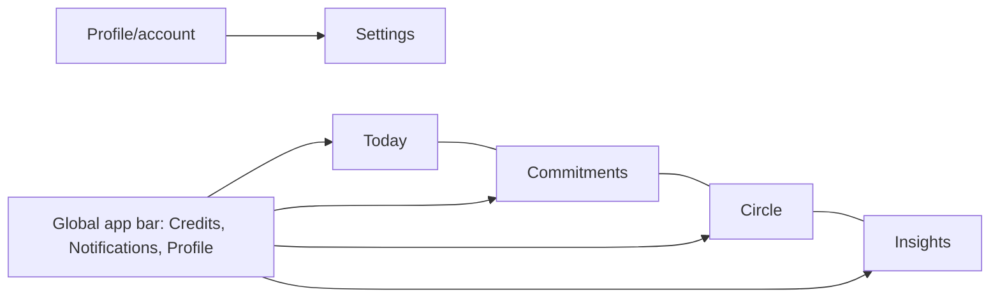

# Revoke 2.0 Mobile Information Architecture

Status: Accepted target mobile information architecture. Phase 1 implemented the global labels and shell destinations; Phase 3 provides the user-facing Commitments management and creation layer; Phase 5 provides the optional Circle and Override Authority surface while retaining legacy persistence and compatibility routes beneath it.

On first entry, the v2 onboarding route is a deterministic state-machine surface. It is not a Circle gate and it does not require all enforcement permissions before the user can see the Reality Check. After a first Commitment is saved, onboarding completes the enforcement-permission and intervention explanation stages before returning the user to Today.

## Primary navigation

The target bottom navigation is:

1. **Today**
2. **Commitments**
3. **Circle**
4. **Insights**

Settings is not a primary tab. It lives under Profile/account. Notifications and Credits are global app-bar utilities where appropriate.

Current `/home` and `RegimesScreen` are migration locations, not the target product vocabulary. Schedules remain enforcement mechanisms beneath Commitments. Current `/squad` is the migration location for Circle. Current `/insights` maps naturally to Insights but must lose Focus Score framing.

## Phase 1 implementation status

`MainShell` presents Today, Commitments, Circle, and Insights through `NavigationBar`. `/home` remains the Today-compatible entry point, `/commitments` now points to `CommitmentsScreen`, `/squad` remains the Circle-compatible entry point, and `/insights` remains the existing Insights entry point. The app bar exposes a zero-valued Credits placeholder, Notifications, and Profile. The placeholder does not imply a Credit backend or purchase implementation.

## Phase 2 Today implementation status

`/home` now renders the dedicated `TodayScreen`. Today owns daily state, the highest-priority current schedule-backed Commitment behavior, usage remaining, active protections, existing week usage evidence, monitoring health, and temporary-access indication. Focus Score is absent from Today but remains available through its compatibility route and legacy detail screen.

## Phase 3 Commitments implementation status

`/commitments` now renders `CommitmentsScreen`, which presents active, upcoming, paused, and attention-needed Commitment summaries. `CreateCommitmentScreen` begins with Reduce/Protect intent, then uses app selection and behavioral configuration before a review step. `CommitmentPresentationAdapter` maps the current schedule-backed implementation into the v2 vocabulary. Existing schedule IDs are preserved when editing. The user-facing model is implemented, but the backend still persists schedules under `users/{uid}/regimes`; a native/server Commitment object is deferred.

## Global app bar

Conceptual arrangement:

`[page/title context]        [Credits pill] [Notifications] [Profile]`

Exact title behavior may vary by surface, but account actions should remain predictable. The Credits pill is compact, shows a coin/Credit icon and integer Available Credits, uses no currency symbol, and opens the detailed Credits/Wallet experience.

The Today surface must not use a large wallet balance card. Credit context appears only when relevant to the active Commitment, such as monitoring verification, Credits locked to that Commitment, or grace.

## Today

Today is the primary daily-state surface. It answers:

- What matters today?
- Am I within my active Commitments?
- What is restricted now?
- How much usage remains?
- How am I doing this week?

Priority order is current daily state, highest-priority active Commitment, usage remaining, active Protect windows, weekly adherence, override/recovery behavior, grace where relevant, and a concise active Commitment list. Do not create an opaque replacement for Focus Score or an equal-weight card grid.

## Commitments

Commitments is the management surface for Reduce and Protect Commitments, active and upcoming items, and completed/history where useful. Users reason about behavioral contracts. Regimes and schedules are implementation details beneath this surface or migration concepts.

## Circle

Circle is the optional Accountability Circle surface. It replaces Squad as the long-term product concept while preserving granular permissions, least-privilege projections, explicit Commitment sharing, and bounded override participation. The current implementation supports member management, six server-enforced permissions, sanitized shared summaries, Override History, and explicit per-Commitment authority. Tribunal remains the detailed decision surface during migration.

## Insights

Insights presents understandable behavioral evidence: adherence, usage trends, reduction trajectory, override patterns, recovery, eventually reliable danger periods, and per-app behavior. It should remain interpretive and focused rather than becoming a generic analytics dashboard. Focus Score is retired.

## Secondary surfaces

| Surface | Relationship to IA |
|---|---|
| Profile | Account identity, profile, account controls, and entry to Settings |
| Settings | Appearance, notifications, controls, whitelist, and account settings under Profile |
| Notifications | Global app-bar entry; not a bottom tab |
| Credits/Wallet | Global app-bar entry; available/locked balances, Premium redemption, purchases, and history |
| Commitment detail | Reached from Today or Commitments; shows evidence, current enforcement, progress, overrides, grace, and relevant Credit lock |
| Native blocker | Full-screen enforcement surface outside Flutter navigation, visually mapped to the same system |

## Migration rules

- Do not let `Regime`, `Schedule`, or `Squad` define new top-level labels.
- Migrate existing schedule cards into Commitment summaries without changing native enforcement ownership in the same pass.
- Retire Focus Score from new surface structure; direct interpretable metrics replace it.
- Keep Profile as the account gateway and do not elevate Settings into primary navigation.
- Keep `selectedMemberIds` (Circle voter authority) separate from `sharedMemberIds` (Commitment summary visibility).
